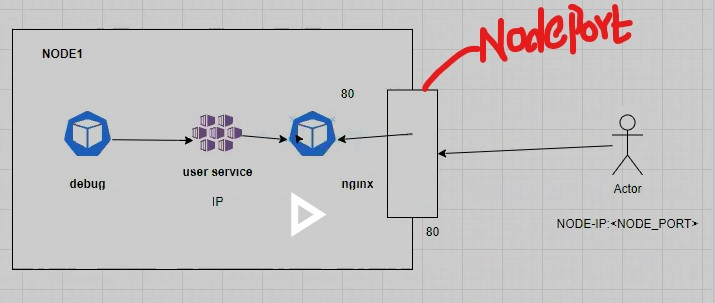

Kubernetes Services:
---------- ---------

Scenario:

We've web pod running and user pod running

Web  --> User

In Docker we configured reverse proxy in web part.
web --> http://user:8080

As we know containers & kubernetes pods, both are ephemeral.
Whenever you restart, same IP Addresses won't be available!

Everytime the IP Address changes.

That's why we configured Name in Docker.

Another Disadvantage in Docker:
Example:

Assume there's 1 web, 2 user containers. How can you configure and loadbalance these 1 web & 2 user conatiners?

- Actually there's no loadbalance feature available by default in Docker.

- Here, we've a concept called service in kubernetes.

Kubernetes:
===========
In kubernetes there's no such concept called Names.
We cannot call other Pods through Names.

We've a concept called service in kubernetes.

Service:
-------

Scenario:

- Assume we've,

Web Pod       User Pod

Every Pod has its IP Address. You can call Pods with it's IP Addressses.

But there's no guarantee that you get the same IP Address after restart.

To overcome this and to keep these Pods in Communication, 
we have a service in between Web and User Pods.

- Let's say the service name as user-service

-------------------------------------
            user-service
             =========
*Web Pod*       *Service*        *User Pod*-------------
             =========                           |
-----------------^--------------------           |
                 | Attaching User Pod to Service |                                      
                 |                               |                
                 ---------------------------------                               
So,               

- We'll attach this Pod with this service.
- Now, this Web should call the service.

- This works like LoadBalancing in kubernetes.

- In web we configure this serice name. Instead of container, we configure this service name.

- You can call User Pod through service.

- If User tarffic is more and another User Pod has been created, 
still you can call with service name, then this service (userservice).
This service will loadbalance between the Pods.

- Kubernetes services are mostly used for LoadBalancing.

What are services in kubernetes?
Ans: To achieve Pod to Pod communication in kubernetes, we've kubernetes services that can work as LoadBalancers. 

If we've multiple Pods, we can attach those Pods to the service,
then other Pods can call with the service name.

# How these Pods know, we should go and attach to this service?
Ans: Through the labels. Labels are useful for the selector purpose.

Kubernetes Service Refernce: https://kubernetes.io/docs/concepts/services-networking/service/

Service Pod Definition:
apiVersion: v1
kind: Service
metadata:
  name: my-service
spec:
  selector:
    app.kubernetes.io/name: MyApp
  ports:
    - protocol: TCP
      port: 80
      targetPort: 9376

labels & selector reference:
https://kubernetes.io/docs/concepts/overview/working-with-objects/labels/

# Types of services in kubernetes:
  ===============================

  In service we've three types:
=============================
1. Cluster IP --> Internal to K8S cluster. It only works for Pod to Pod communication.

Scenario:

debug Pod        user-service      nginx

- We cannot access this ngix pod from outside with clusterIP.
- The clusterIP is useful only for internal communication of the Pods.
- You can't access this nginx Pod from internet.

For this purpose we've further service called NodePort.

2. NodePort:

Nodeport is the type of service, we can expose the port of the node actually.

- This is the Node, a port will be opened. 

- Just like in containers we opened the Host Port.
- Here the same happens in nodeport, a nodeport will be opened for the outside purpose.

- From internet you can access this.

- Nodeport is the type of service, we can expose the port of the node actually. The container port will be attached to this nodeport.

- Now, user call like this NODE-IP<NODE_PORT>  
- Then, request comes to the nodeport, then 
it'll forward the traffic to the container.

[We did in Docker Host Port]

- By default, if you not defined anything, then it'll be cluster IP.

refernece NodePort: https://kubernetes.io/docs/concepts/services-networking/service/

